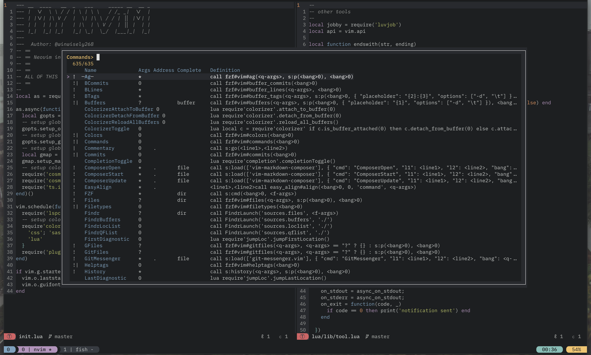
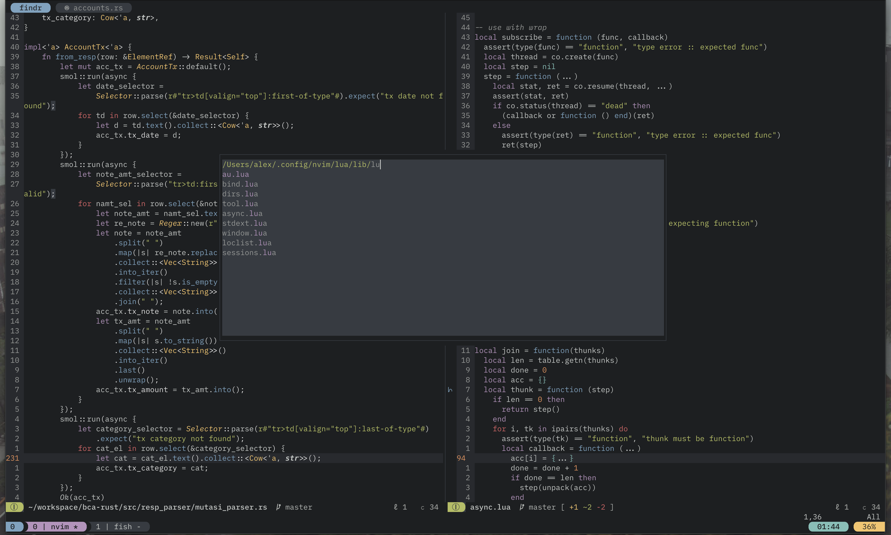

```
 ___   _     _____     _______   __  ____   __  __  __ _____ ____ ____  
|_ _| | |   / _ \ \   / / ____| |  \/  \ \ / / |  \/  | ____/ ___/ ___| 
 | |  | |  | | | \ \ / /|  _|   | |\/| |\ V /  | |\/| |  _| \___ \___ \ 
 | |  | |__| |_| |\ V / | |___  | |  | | | |   | |  | | |___ ___) |__) |
|___| |_____\___/  \_/  |_____| |_|  |_| |_|   |_|  |_|_____|____/____/ 
                                                                        
```

Screenshots are using tomorrow night






## Features

- Colemak bindings ('hnei') variant
- Lazy load packages via packer.nvim
- A companion mini.lua for compatibility with `asvetliakov/vscode-neovim`
- Custom non-distracting statusline (it's actually quite distracting)
- TODO: Debugging Adapter Protocol (Not a fan of vimspector)
- Doesn't support vanilla vim

## Mappings

See `
	global/mappings.vim
	plugin/options.vim
`

## Theme(s)

- Nord-ish (minimal version of arcticicestudio/nord.vim)
- Gruvbox Material-ish (minimal version of sainnhe/gruvbox-material)
- Tomorrow Night-ish (minimal version of base16 tomorrow-night theme)

## Plugins in use

###### Package Management

- packer.nvim (lua interface to builtin package manager)

###### Dependencies

- plenary.nvim => for hererocks and other 3rd party lua packages should you need it.
- luvjob.nvim => wrapper around nvim libuv
- expressline.nvim => easily roll your own async statusline

###### Editor enhancement

- vim-surround (yslw, cs, S, ds)
- fzf.vim (fuzzy finder)
- vim-easy-align (for prettifying stuff)
- vim-sneak (nice motion plugin)
- vim-mundo (Undotree)
- nvim-colorizer.lua (pretty colors, great stuff)
- vim-commentary (commenting)
- findr.nvim (Emacs's ivy on neovim)

##### Git

- vim-signify (async gutters)
- git-messenger.vim (cool hovering blame)
- gitui (not a plugin, but an external git ui)

##### LSP, Completion and Highlighting

- nvim-lsp (builtin lsp neovim-nightly)
- completion-nvim (completion for builtin lsp)
- diagnostic-nvim (for jumping around diagnostics)
- nvim-treesitter (seriously awesome)

##### Filetype specific

- Go: vim-go
- Markdown: vim-table-mode, vim-markdown-composer (live-preview)
- Latex: vimtex
- Lua: nvim-luadev (lua repl)
- Formatting: sbdchd/neoformat (for you know, formatting stuff)

##### Productivity
- wiki.vim (minimal vimwiki alternative)

##### Misc

- firenvim => nvim in yo browser

## Credits (List of people I stole config from)

- tjdevries
- mfussenegger
- theHamsta
- fsouza
- cyproterone / ms-jpq

## TODO

- [-] nvim-dap
- [X] treesitter
- [-] fix bootstrapping script
- [-] CI
